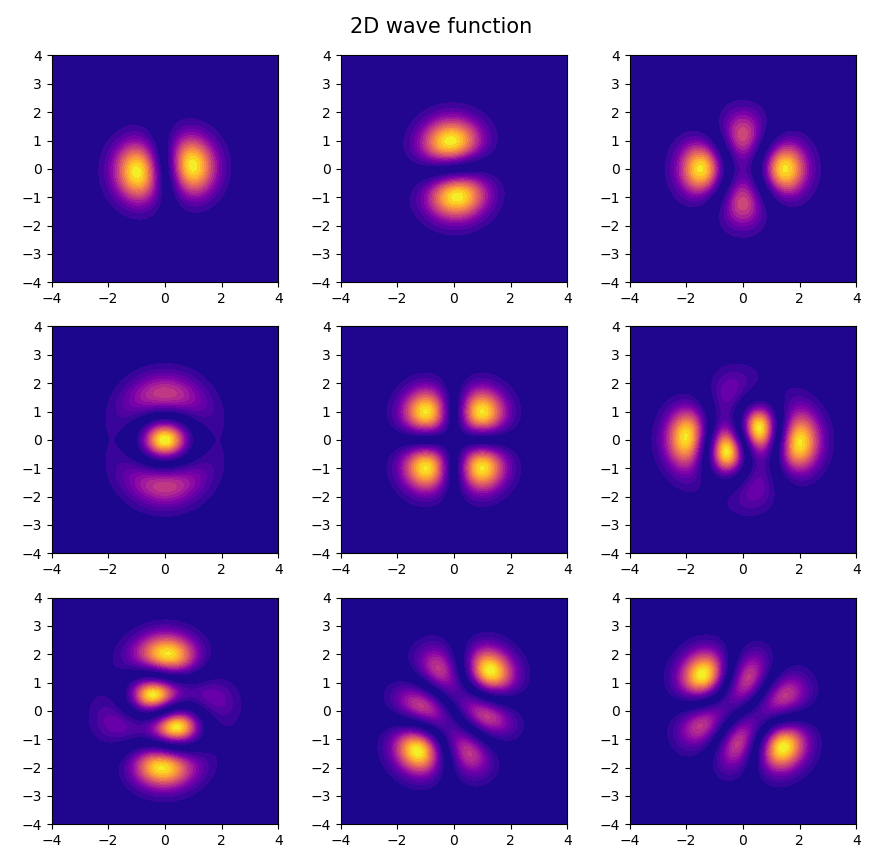
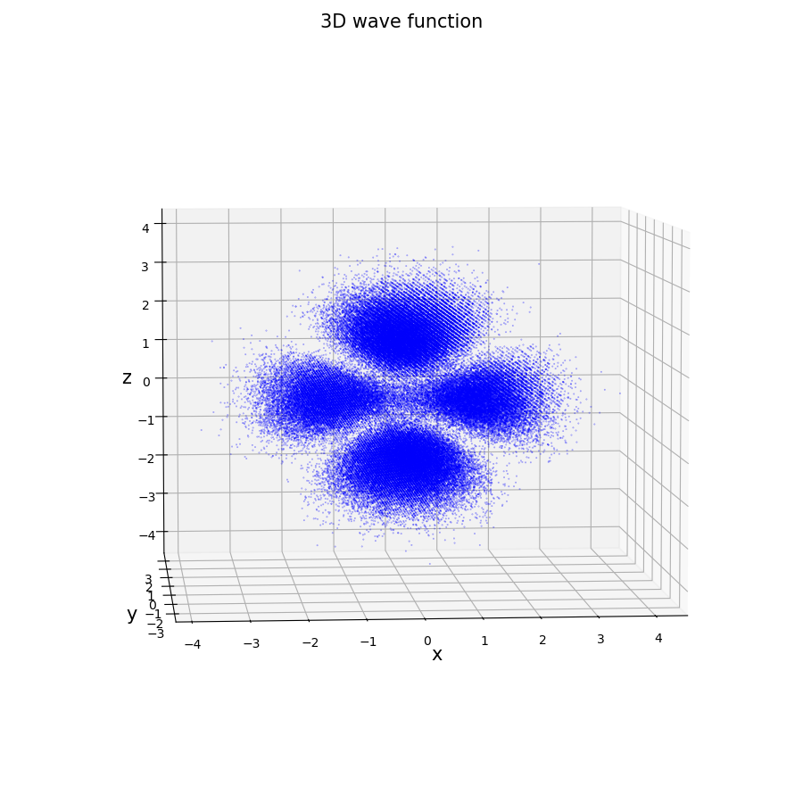

# H \psi = E \psi
In these codes the finite difference method and the shooting method is used to solve the Schrodinger equation for some potentials. With the firt method we consider 1D 2D and 3D case.

## Finite difference
For the first method the precision is of O (h^2) and since h = L / n with n number of points, the states with high energy being spatially more extended require a greater L and consequently a greater n to keep h small. 

## Shooting method
For the shooting method you can choose the tolerance on the search for the eigenvalue; on psi the error is that of the numerical integrator.

For oscillator and finite well we use the simmetry of potential to solve the equation only for positive x and after readjust all.

